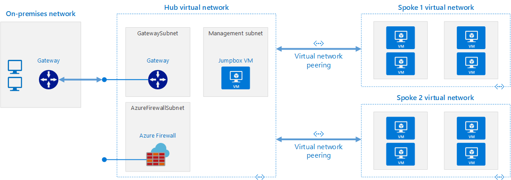

# Terraform 

This demo serves as means to test an applicant's `terraform` and `git` skills. The following are a set of instructions to complete the deployment of a Landing zone in Azure.

## Instructions

Please follow the set of instructions set out as follows:

1. Fork this repository.
2. Make the code changes.
3. Create a PR to this repo.

The PR will be reviewed as part of the application. Please ensure that the terraform plan output is included in the PR for review.

### Expected Architecture

You will need to complete the `main.tf` with the infrastructure as laid out in the following diagram. This shows the landing zone with all components as it should be deployed for a customer.

> There is no need to configure the VPN Gateway for on-prem connectivity as part of this exercise.

### Modules

The following modules are included:

* firewall
* nsg 
* storage
* vnet/subnet
* vnet/vnet
* vnet/vnet_peering
* vpn_gateway

> You will need to add modules for remaining components of the architecture including the Jump box.

### State

The terraform state does not need to be remote for this exercise.

### Commit

Please commit as regularly as possible so that your progress can be checked at each step.
